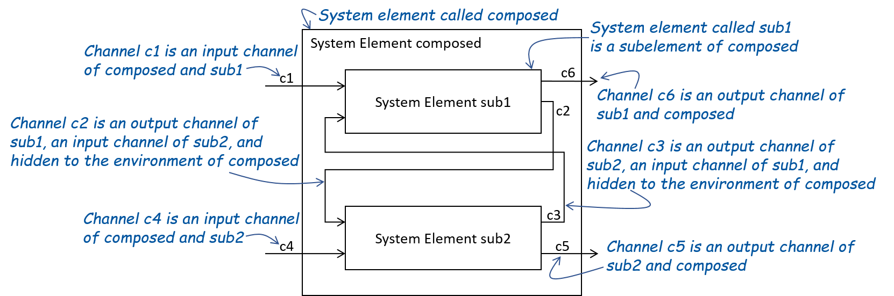
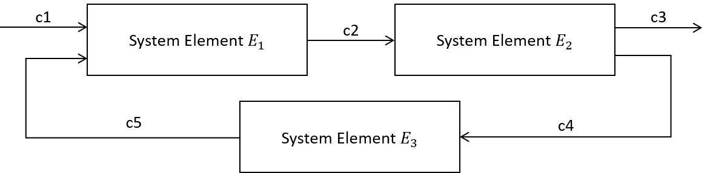

<script type="text/javascript" id="MathJax-script" async
  src="https://cdn.jsdelivr.net/npm/mathjax@3/es5/tex-mml-chtml.js">
</script>

<script>
  MathJax = {
    tex: {
      inlineMath: [['$', '$']]
    }
  };
</script>


# Universal Interface Model

The universal interface model (UIM) delivers the foundation for describing interfaces and behavior across all viewpoints. As such, as SPES ML modeler, you will never explicitely instantiate elements of the UIM, as you will instead create elements of the functional, logical and technical viewpoints. However, as the UIM is the basis for all interfaces in each viewpoint, you will implicitely use the UIM all the time. The following section describe the concepts of the UIM and how they map to SPES ML model elements of the different viewpoints. The description uses a mathematical language to describe the concepts. While it is certainly helpful to have an understanding of the underlying mathematical theory, the actual modeling with SPES ML is done on a higher level of abstraction.

## General Concepts
### System Elements

A system element models the behaviors of (a part of) a system. Each system element consists of a syntactic and a semantic interface. An example for a system element in the logical viewpoint is a logical component.

The *syntactic interface* describes the system element's input and output channels where each channel is a typed communication link between system elements.
In the context of the communication between system elements, the instances of the data types are called *messages*. 
For example, the instance ```5``` of the data type ```int``` is said to be a message when it is communicated over a channel.
Only messages of a channel's data type may be communicated via the channel.

A system element is called *atomic* if it has no subelements. Otherwise, it is called *composed*.
Atomic system elements are not further composed and directly have behavior descriptions linked to them (e.g. state machine models). 
The following figure depicts the relation between system elements, channels, and data types. 

<div align="center">

<br><b>Figure:</b> 
Relation between system elements, channels, and data types.
</div><br>

System elements interact via sending and receiving typed messages via their input and output channels.
The *semantic interface* defines the behavior of the system element by relating streams of messages received by the system element on its input channels to the
streams of messages emitted by the system element via its output channels. 
As described in the following, the semantic interface of an atomic system element can, inter alia, be defined by a state machine. The semantic interface of a composed system element is always defined by the composition of the semantic interfaces of its subelements.
 
### Syntactic Interface
The _syntactic interface_ $I \blacktriangleright O$  of a system element is defined by a set of input channels $I$ and a set of output channels  $O$ . 
A syntactic interface can be given in terms of sub-interfaces $(I_1 \blacktriangleright O_1), \ldots,(I_n \blacktriangleright O_n)$, where the sets of input channels respectively the sets of output channels are mutually exclusive. 
The resulting syntactic interface then is $\bigcup_i I_i \blacktriangleright \bigcup_j O_j$. Finally, the _inverse_ to a syntactic interface  $I \blacktriangleright O$ is the syntactic interface  $O \blacktriangleright I$

For instance, the following figure schematically depicts the system element $F$. The syntactic interface of $F$ is $\{ c1, c2 \} \blacktriangleright \{ c3,c4,c5 \}$.
The channel $c1$ is of type $T$. It is abstracted from the definition of the type $T$ in the picture.  

<div align="center">

<br><b>Figure:</b> 
A system element and its syntactic interface.
</div><br>


### Semantic Interfaces
The _semantic interface_ (or interface behavior) of a system element with the syntactic interface $I \blacktriangleright O$ is given by a function mapping an input communication history to a set of output communication histories $F: \overrightarrow{I}\rightarrow \wp (\overrightarrow{O})$. 
For each possible input $x \in \overrightarrow{I}$ on the channels contained in $I$, the function specifies all possible outputs $F(x)$ for the input. Thus, the function $F$ represents
an underspecified behavior of a system element with the syntactic interface $I \blacktriangleright O$.

### Causality
A semantic interface $F: \overrightarrow{I}\rightarrow \wp (\overrightarrow{O})$ is called _weakly causal_ (_strongly causal_), if the output up to time-point $t$ only depends on the input received until $t$ (until $t-1$ in case of _strongly causal_ behavior).
Formally, 
* a function $F: \overrightarrow{I}\rightarrow \wp (\overrightarrow{O})$ is called weakly causal if it holds that $\forall t \in \mathcal{N}: \forall x,y \in \overrightarrow{I}: x \downarrow t = y \downarrow t \Rightarrow F(x) \downarrow t = F(y) \downarrow t$.
* a function $F: \overrightarrow{I}\rightarrow \wp (\overrightarrow{O})$ is called strongly causal if it holds that $\forall t \in \mathcal{N}: \forall x,y \in \overrightarrow{I}: x \downarrow t = y \downarrow t \Rightarrow F(x) \downarrow (t +1) = F(y) \downarrow (t + 1)$.

If a semantic interface is not weakly causal, then it cannot be realized by any system element. 
This holds because semantic interfaces that are not weakly causal can be interpreted to model behaviors that can react to events (receiving of messages)
that happen in the future. Stated differently, if a semantic interface is not weakly causal, then the system element can already react in a time unit $t$ 
to an input that it receives in a later time unit $t'$ with $t' > t$ (for at least one input communication history).

Strongly causal semantic interfaces are even more restricted in the sense that every strongly causal semantic interface is also weakly causal. For strongly causal
interface behaviors, the output in a time unit $t + 1$ only depends on the messages received up to and including the time unit $t$. Thus, without even
receiving a message in a time unit, the component can already determine its possible outputs for the time unit. 
Every strongly causal semantic interface is also weakly causal.
Strongly causal semantic interfaces are useful 
in the context of the composition of system elements. The composition of a strongly causal system element with another system elements guarantees nice properties
in the sense that the compostion is guaranteed to be a well-defined system element. This is explained in the following sections in more detail. 

### Causaility on a subset of channels
Strong-causality can also concern only a subset of the output channels.
A semantic interface $F: \overrightarrow{I}\rightarrow \wp (\overrightarrow{O})$ is called _strongly causal modulo_ $P \subseteq O$
iff it holds that $F$ is weakly causal and  $\forall t \in \mathcal{N}: \forall x,y \in \overrightarrow{I}: x \downarrow t = y \downarrow t \Rightarrow (F(x)|P) \downarrow (t +1) = (F(y)|P) \downarrow (t + 1)$. 
The requirement for weak causaility ensures that it can be realized by a system
element. The second condition is a relaxation of the definition of strong
causality. A semantic interface is strongly causal modulo a subset of its output
channels $P$ if the outputs of the semantic interface up to time unit $t+1$
on the output channels contained in $P$ solely depend on the inputs received
up to time unit $t$. The messages emitted via the other output channels (not
contained in $P$) in a time unit $t$ may depend on the messages received in
the time unit $t$. A semantic interface is strongly causal modulo the set of
all of its output channels iff it is strongly causal. The more fine-grained
definition of strong causality is also very useful in the context of system
element composition. The composition of two system elements yields a
well-defined system element if one of the system elements is strongly causal
modulo its output channels that are the input channels of the other system
element. In the following, this is explained in more detail.

### Introducing Strong Causality by Adding Output Delay
Every weakly causal semantic interface can be transformed 
to a semantic interface that is stronly causal modulo some of its output channels by 
- delaying the messages communicated on the output channels and 
- adding initial outputs to the channels (initial outputs may be empty sequences). 

This is useful because, in general, it cannot be automatically proven whether a
semantic interface is strongly causal modulo some of its output channels. In
these cases, it is often hard for developers to determine whether the
composition of two semantic interfaces (resp. system elements) is well-defined
because the well-definedness either (1) needs to be proven manually by hand or
(2) is not ensured at all, which might result in undesired behaviors.

Instead, developers can explicitly delay some of the output channels to obtain
semantic interfaces that are strongly causal modulo the output channels by
construction. This eliminates the necessity for manual causality proofs and
potentially undesired behaviors resulting from ill-formed compositions.
The transformation is defined as follows: 

Let $F: \overrightarrow{I}\rightarrow \wp (\overrightarrow{O})$ be a weakly
causal semantic interface and let $P \subseteq O$ be a subset of the output
channels of $F$. Let $init: P \rightarrow M^\ast$ be a function mapping each 
channel $c \in P$ where $c : t$ to a finite stream of messages of its type $init(c) \in t^\ast$. The function 
$init$ maps each channel to a stream of messages that should be initially 
communicated over the channel.  

Then, delaying the semantic interface $F$ with respect to 
$init$ results in the semantic interface $G: \overrightarrow{I}\rightarrow \wp (\overrightarrow{O})$ 
satisfying the following two conditions for all inputs $x \in \overrightarrow{I}$ and output channels $c \in O$:
- $(G(x))(c) = (F(x))(c)$ if $c \notin P$ and
- $(G(x))(c) = \{ init(c) \cdot y \;|\; y \in F(x) \}$ if $c \in P$.

For every input, the outputs of the semantic interface $G$
- on the channels not contained in $P$ 
is equal to the outputs of $F$ on these channels when given the inputs.
- on the channels contained in $P$ are obtained by prefixing the corresponding initial sequences to the outputs that 
are produced by $F$ for the inputs.

By construction, the semantic interface $G$ is strongly causal modulo $P$.

### Describing Semantic Interfaces

A semantic interface can be described by an interface assertion involving the
input and output channels of a system element. Equivalently, in case the
behavior is weakly causal, it can be described by a state machine, e.g. a Mealy
Machine. System elements, their syntactic interface, and their interface
behavior can be composed to form again a system element with composed syntactic
and semantic interfaces.

### Composition of system elements

Composed system elements consist of several subelements. The following figure
schematically depicts the composition of the subelements of a composed system
element by the example of a system element consisting of two subelements. The
set of input channels of a composed system element must be equal to the set of
all input channels of its subelements, which are no output channels of any other
subelement. This ensures that all subelements receive messages via their input
channels during runtime, even if the composed system element is further composed
with other system elements in a larger architecture. The input channels of
subelements that are also output channels of other subelements cannot be used as
input channels by the environment anymore.  

Every pair of subelements must have pairwise different sets of output channels.
Thus, in any architecture consisting of arbitary many system elements, each
channel is the output channel of at most one atomic system element. This ensures
that two subelements never send messages on the same output channel. The set of
output channels of a composed system element must equal to the set of output
channels of its subelements. With this, it forwards the messages sent from its
subelements via the output channels.  

<div align="center">

<br><b>Figure:</b> 
Schematic illustration of system element composition.
</div><br>

The semantic interface of a composed system element is defined by the
composition of the semantic interfaces of its subelements. The subelements
communicate via their channels. The messages sent by a subelement via one of its
output channels are received on this channel by all subelements having it as one
of their input channels. The receiving subelements, on the other hand, produce
outputs based on the received inputs. With this, the behaviors of the
subelements influence each other via communicating messages over the channels,
which ultimately defines the behavior of the composed system element.  

The composition of system elements is not always well-defined in the sense that
the semantic interface of a composed system element does not define a possible
output for every possible input. Fortunately, this situation can be avoided if
at least one system element in every cycle of interconnected system elements is
strongly causal. A cycle of interconnected system elements is an ordered set of
system elements $E_1, E_2,..., E_m$ such that $E_{i +1}$ has an input
channel that is an output channel of $E_{i}$ for all $i < m$ and $E_1$ has
an input channel that is an output channel of $E_m$. In this case, the
semantic interface of a composed system element is guaranteed to be well-defined
(i.e. weakly causal and defines an output for every possible input).
Thus, it especially holds that the semantic interface of a composed system
element is guaranteed to be well-defined by construction if all semantic
interfaces of all subelements of the system element are strongly causal. More
specifically, then the semantic interface of the composed system element is even
strongly causal. In contrast, the semantic interface of a composed system
element is not always strongly causal if it consists of at least one subelement
that has no strongly causal semantic interface.

For example, the following figure depicts the composition of the three system elements $E_1, E_2$ and $E_3$. 
Assume that all of the system element are weakly causal.
On the one hand, if all of the system elements are not strongly causal, then the composition might not be well-defined.
On the other hand, if at least one of the three system elements is strongly causal, then the composition is guaranteed to 
be well-defined. 

<div align="center">

<br><b>Figure:</b> 
Composition of three system elements.
</div><br>

The well-definedness of the composition can also be determined by considering
the notion of strongly causal modulo. With this, we obtain a more fine-grained
condition for determining whether the composition of multiple system elements is well-defined. 
If for every cycle of interconnected system elements $E_1, E_2,..., E_m$, 
there exists an index $0 < i < m$ such that $E_i$ is strongly causal modulo its output channels that are
input channels of $E_{i+1}$ or $E_m$ is strongly causal modulo its output channels that are
input channels of $E_1$, then the semantic interface of the composed sytem element is guaranteed to be well-defined.

For example, the previous picture depicts the composition of the three system
elements $E_1, E_2$ and $E_3$. Assume that all of the system elements are
weakly causal. Further assume that none of the system elements is strongly
causal. Then, the composition might not be well-defined. The composition includes exactly one cycle 
$E_1, E_2, E_3$ of interconnected system elements. From the above, we can conclude that the composition 
is well-defined if $E_1$ is strongly causal modulo $c2$ or $E_2$ is strongly causal modulo $c4$
or $E_3$ is strongly causal modulo $c5$. In this case, $E_1$ (resp.
$E_3$) is strongly causal modulo $c2$ (resp. $c_5$) iff $E_1$ (resp.
$E_3$) is strongly causal because $c2$ (resp. $c_5$ ) as $c2$ (resp. $c_5$ ) is the only output
channel of $E_1$ (resp. $E_3$ ). As by assumption, the system elements are
not strongly causal, it holds that $E_1$ (resp. $E_3$) is not strongly
causal modulo $c2$ (resp. $c_5$). However, if $E_2$ is strongly causual
modulo $c4$, then the composition is well-defined, although none of the system
elements is strongly causal.

#### Formal Foundations of Composition 

System elements, their syntactic interfaces, and their semantic interfaces can be composed to form again a system element with an aggregate syntactic interface and semantic interface. We compose systems from subsystems specified by their interface behavior to create composed systems. 

Two syntactic interfaces $I_k = X_k \blacktriangleright Y_k$ with $k = 1, 2$ are called _composable_, if  $Y_1 \cap Y_2 = \emptyset$, i.e. the sets of output channels are mutually exclusive.
The composition of two composable syntactic interfaces $I_k = X_k \blacktriangleright Y_k$ with $k = 1, 2$ is defined as the syntactic interface  $I_1 \otimes I_2 = X \blacktriangleright Y$ where $X = (X_1 \cup X_2) \setminus (Y_1 \cup Y_2)$ and $Y = (Y_1 \cup Y_2) \setminus (X_1 \cup X_2)$. Thus, the resulting input channels are the input channels that are not output channels. Similarly, the output channels are the output channels that are not input channels. If a channel is an output channel of one syntactic interface and an input channels of the other syntactic interface, then it is hidden from the environment in the syntactic interface resulting from the composition.  

The semantic interface of the composed system element can be described by the logical conjunction of the interface assertions of the composed system elements.
If $I_k = X_k \blacktriangleright Y_k$ for $k = 1, 2$ are two composable syntactic interfaces and $F_k$ for $k = 1, 2$ are semantic interfaces with the syntactic interfaces $I_k$ for $k = 1, 2$, then 
the composition of $F_1$ and $F_2$ is defined as the function $(F_1 \otimes F_2): \overrightarrow{I}\rightarrow \wp (\overrightarrow{O})$ where $I \blacktriangleright O = I_1 \otimes I_2$ satisfying 

$(F_1 \otimes F_2)(x) = \{ y|O : y \in \overrightarrow{Z} \wedge y|I = x \wedge y|Y_1 \in F_1(y|X_1) \wedge y|Y_2 \in F_2(y|X_2) \}$ for all $x \in \overrightarrow{I}$ where $Z = X_1 \cup X_2 \cup Y_1 \cup Y_2$.

Parallel composition of components may involve feedback channels, i.e. the set of channels $Z := (X_1 \cup X_2) \cap O$. The streams communicated over the channels contained in $(I1 \cup I2) \cap O$ correspond to feedback and this way to fixpoints (i.e. $x = F(x)$ for a composition in terms of behaviors). In case of strong causality of $F$, the fixpoint always exists and is unique according to the Banach fixpoint theorem. For weakly causal functions that are not stronly causal the existence of such a fixpoint cannot be guaranteed.

More intuitively, the composition of two weakly causal semantic interfaces with composabel syntactic interfaces is not always a weakly causal semantic interface. Sometimes, it even holds that the composition is a function that does not map every input communication history to at least one output communication history, i.e., there are no well-defined outputs for all inputs.
This complication can occur in the presence of feedback loops. 
However, this complication is avoided if at least one of the composed semantic interfaces is strongly causal. Then, the resulting function is guaranteed to be a well-defined weakly causal semantic interface. If even both of the composed
semantic interfaces are strongly causal, then the resulting semantic interface is also guaranteed to be strongly causal.   

The composition of two weakly causal semantic interfaces with composabel syntactic interfaces is well-defined 
if one of the semantic interfaces is strongly causal modulo its output channels that are input channels of the other semantic interface. 


## Model Elements
