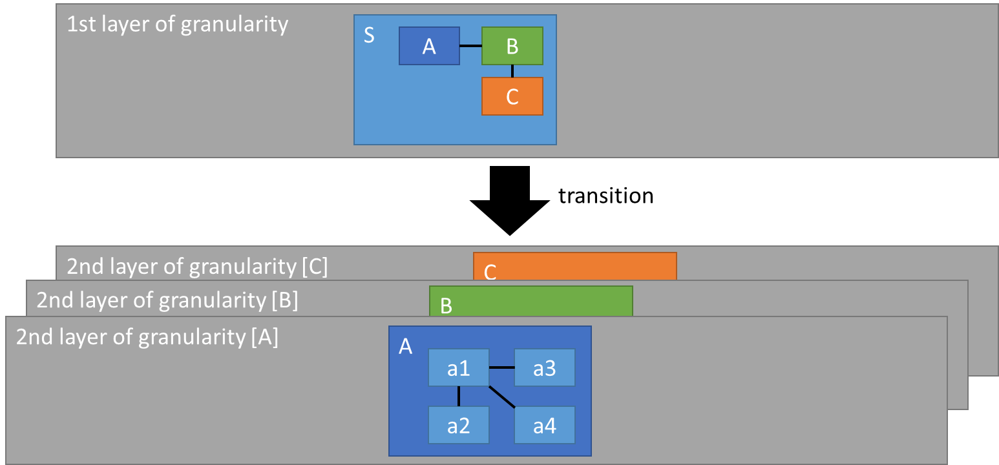
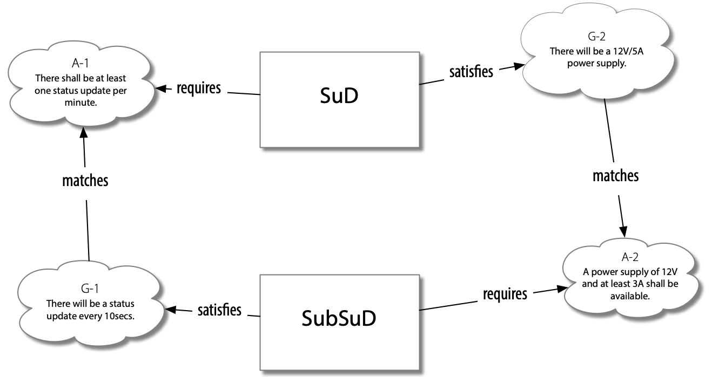

# Subsystems
The structuring of the models in the individual views described in the
previous sections allows components from the technical view to be viewed
as independent (sub-) systems that can be developed with independent
processes, methods and tools. Of course, the SPES methodology can also
be applied recursively to subsystems.

All subsystems of a super-system are combined in one granularity level.
It is irrelevant which methodology (processes, methods, tools) is used
to develop the subsystems of a granularity layer.

### Definition of Subsystems

Whether a technical component is further refined as a subsystem or is
further refined in the models of the technical view depends on the
context of the specific development project. For example, a subsystem
will be defined if the development responsibility for the component
changes (supplier relationship) or a "suitable" component already exists
that is then to be reused.

In principle, it is of course possible to declare all components in the
technical view as subsystems and to further refine them at the next
level of granularity, thus achieving a clear tree structure of the
entire SuD into subsystems. However, it must be taken into account that
with each transition to a new granularity level, the model complexity
increases. The reason for this is the context models of the subsystems,
which cannot be taken over 1:1 from the models of the super-system (see
chapter 6.4 for further details).

It is important to note that subsystems always have an independent
architecture and an associated technical implementation. How models of
the architecture of the subsystem and the technical implementation can
be derived from the models of the super-systems depends on the nature of
the tracing relationships of the models in the super-system.

### Top-Down vs. Bottom-Up Development[^1]

We distinguish between two basic approaches for system development, the
top-down and the bottom-up approach, which can also be combined
depending on the use case.

The top-down approach starts with modeling the super system (usually at
the first level of granularity) and recursively defines subsystems at
lower layers of granularity.

This approach is often found in the development of new systems
(greenfield development). Figure 12 shows an example of a top-down
approach. The system (S) is decomposed into three components (A, B, C).
All these three components should possibly be further developed at a
lower level of granularity, so that the models of 3 subsystems are
located at the 2nd level of granularity (one for each component). This
approach can be repeated recursively to create a deeper nesting of
granularity levels.

Figure 1: Example for Top-Down-Development

In contrast, the bottom-up approach starts at a lower level of
granularity. Low-level systems are combined and integrated to form
higher-level systems, i.e. we compose the system, from a set of
(possibly already existing) subsystems. This approach is often found in
building block approaches, where already available systems are combined
to develop the super-system. The following figure shows an example of a
bottom-up approach: at the 2nd level of granularity, there are 3
subsystems, each describing a component of the super-system. These
components (A, B, C) are then integrated at the 1st level of granularity
with their black-box view to form the super-system (S). Internally,
these subsystems can be further structured (component A in the example).

Figure 2: Example for Bottom-Up- Development

Both approaches can also be combined: While some parts of the
super-system are built using existing subsystems, other parts may need
to be developed and described first at the super-system level before
being progressively developed at lower layers of granularity. Common to
both approaches and their combination is that a transition between the
different layers of granularity is required.

### Bottom-up development against assumed requirements

In bottom-up development in particular, subsystem developers face the
problem that the requirements for the subsystem have not yet been
defined. To a certain extent, however, this problem also arises in
top-down development when subsystem development takes place alongside
system development and begins even before the requirements have been
fully defined. In such - particularly in the highly work-sharing
automobile industry - situations subsystems are developed first against
assumed requirements, which are brought into the super-system context at
a later time.

To make this possible, the following requirements must be met by the
subsystem:

-   A subset or refinement of the textual requirements of the
    super-system.

-   Super-system constraints with reference to the subsystem.

-   Additional constraints on the subsystem arising, for example, from
    context relationships.

-   Requirements that result from the interface models of the
    super-system in the FVP, LVP, and TVP.

In this approach, subsystems may still have additional requirements as
well as their own context that must be considered for its development.
SpesML offers two additional tracing relationships to express this
situation (see Figure 11 for an example):

-   Require (from model element to requirement): This relationship
    states that a model element - typically a function of the FVP or a
    component of the LVP, or the TVP - has certain expectations that are
    to be fulfilled by the context of the model element.

-   Matches (from requirement to requirement): This relationship
    expresses that expectations are provided by properties guaranteed by
    the subsystem.

Figure 3: Matching guarantees to assumptions

A verification obligation also for these two relations arises from their
use in a model.

### Operational Context Across Layers of Granularity

The logical architecture at granularity level n defines the operational
context at granularity layer n+1. More precisely, the operational
context at layer n+1 is a projection of the context at layer n defined
as follows:

-   The operational context is always defined with reference to a SuD.
    The SuD on layer n+1 (SuDn+1) is a system element
    (component) selected from the logical architecture in layer n.

-   The operational context on layer n+1 contains all context elements
    from the SuDn that have a channel to the selected system
    element in the logical architecture on layer n.

-   Furthermore, the operational context contains all system elements
    (components) from the SuDn logical architecture that have
    a channel to the selected system element in this architecture. It
    should be noted that these system elements are not 1:1 copies of the
    components of the SuDn logical architecture. Only the
    interface of a context component to SuDn+1 is
    syntactically and semantically identical.

### Integration of Subsystems into the Super-System

We always use the paradigm of the universal interface model to integrate
a subsystem into the super-system. In particular, the integration of the
subsystem is always done as a black- box based on its syntactic (and
semantic) interface.

In the top-down case, and following the design recommendations from this
document, we can identify a component in the technical view of the
super-system that represents the subsystem and is defined by the
corresponding models in the logical and technical views of the
super-system. The universal interface concept allows the subsystem to be
integrated into both the logical view models (syntactic and semantic)
and the technical view models (syntactic), each as a black-box.

If, for a SW subsystem, white-box functions of the functional white-box
models can be uniquely assigned to a logical SW component, there is a
canonical relationship between those white-box functions in the
functional view and the SW-subsystem.

In the bottom-up scenario, one usually refers to already existing
subsystems, which were developed independently of the super-system (and
of the further subsystems) on the respective layer of granularity (reuse
case). To be able to integrate existing subsystems on the layer of the
super-system, the subsystem must meet the following requirements:

-   Fulfillment of requirements of the super system: The subsystem must
    fulfill the requirements specified by the super system. To do this,
    it is not necessary to adopt requirements 1:1 in the subsystem. The
    subsystem can also "overfulfill" requirements, i.e. offer more than
    is required by the super system. In SpesML, the "matches" trace
    relationship is introduced for this purpose.

-   Interfaces of the subsystems to be integrated: The subsystems are
    integrated into the super-system according to the UIM paradigm. To
    this end, the syntactic interfaces (message types and ports) in
    particular must first be aligned at the model level in all three
    views. This requires refinement or abstraction steps of the
    syntactic interfaces. Alternatively, the models of the super system
    can be adapted accordingly to enable direct model integration of the
    subsystem (e.g., during reuse).

This will usually require a wrapper that adapts the interfaces of the
subsystem syntactically and semantically accordingly to meet the
requirements for the interface of the super-system and its context,
i.e., in particular, the syntactic interfaces (message types and ports)
must be aligned. For an integration at model level this requires
refinement or abstraction steps of the syntactic interfaces.

Depending on the current development situation, this adaptation can be
performed at the super-system level (e.g., to integrate an existing
component directly) or at the subsystem level (e.g., by a supplier). A
combination of both approaches is of course also conceivable.

If we assume the proposed relation between the models of the logical and
technical views of the super-system (see chapter 5.2) it is possible to
integrate the subsystem models in both views. Since the models from the
two views model different properties of the subsystem (abstract
interface behavior in the logical view and technical implementation of
the syntactic interface), both models contribute decisively to the
definition of the subsystem.

In addition, if white-box functions that are realized in SW have already
been identified in the white-box models of the functional view of the
super-system those white-box functions become system function of the SW
subsystem (at the next layer of granularity), which means that
meaningful tracing relationships between system functions of the SW
subsystem and those white-box functions exist.

[^1]: See also
    https://git.rwth-aachen.de/spesmlgroup/spesml/-/blob/master/04_Arbeitspakete/Tooling/granularity%20layer%20transitions/Granularity%20Layer%20Transitions.md
