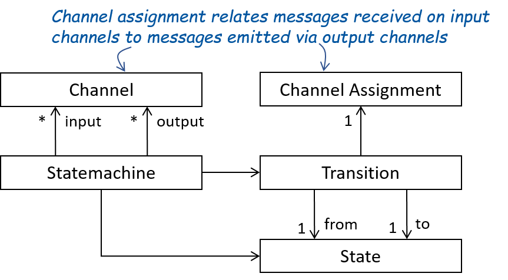

# State Machines 

The behavior of atomic system elements can be defined by state machines. The following introduces a reduced abstract syntax for state machines. The syntax can easily be extended by guards on transitions, hierarchical states, and further advanced concepts. However, every practically meaningful (weakly-causal and realizable)  semantic interface can be modeled with a state machine solely using the reduced abstract syntax. Thus, it is always possible to transform a state machine with an extended syntax to a semantically equivalent state machine in the reduced abstract syntax.    

As depicted in the following figure, each state machine consists of 
* states,
* initial states, 
* transitions, 
* input channels, and 
* output channels. 

Each transition consists of 
* a source state, 
* a target state, 
* an assignment mapping each input channel of the automaton to a finite stream of messages of the channel's type, and
* an assignment mapping each output channel of the automaton to a finite stream of messages of the channel's type.  

 <b>Figure 1:</b> State-machine concepts 

 

For a state machine to be meaningful, it must define a possible output for all possible inputs for each of its states. 
Otherwise, the behavior of the state machine could be undefined for some inputs. 
This even holds in case the state machine should not react to some input in some state at all, neither by changing its state nor by sending messages. 
In implementations, omitting explicit reactions can be interpreted as syntactic sugar for some default behavior or for arbitrary behavior. 
However, when considering the reduced abstract syntax, the following rule of well-formedness applies: 
Well-Formedness Rule: For each state and each possible input channel assignment (mapping the input channels to finite streams of the channels' types), 
the state machine must contain at least one transition that starts in the state and has the input channel assignment. 

A run of a state machine represents the behavior of the state machine in response to received input and progressing time. A run of the state machine starts
in one of its initial states. Afterwards, the state machine receives inputs on its input channels and the time progresses. 
In each time unit, the state machine receives inputs via its input channels. 
When the time unit ends, the state machine changes its state based on a transition that (1) starts in its current state and (2) is enabled by the input received in the current time unit. 
The transition is enabled if the received streams on the input channels are equal to the streams for the channels as defined by the input channel assignment of the transition. 
When taking such a transition, the state machine outputs the messages as specified by the output channel assignment of the transition on its output channels and changes its state to the transition's target state.
In the next time unit, it proceeds analogously in its updated state. 

The communication history produced by a run is defined by the streams of messages that are communicated via the channels of the state machine during the run. 
Thus, communication histories abstract from the internal state changes that are not observable to the environment of state machines. 
Thus, communication histories represent a black-box view on runs of state machines where each communication history solely contains the information available to the environment of the state machine. 
The relation between the possible input and output communication histories of all runs of a state machine induce the state machine's semantic interface. 
With this, the semantic interface of a state machine is the function relating all possible input channel communication histories to all possible output channel communication histories as defined by the state machine.

## Mealy and Moore Machines
We can distinguish two different types of state machines, Moore Machines and Mealy Machines.
A **Moore Machine** is a state machine where the output of each transition solely depends on the source state of the transition and not on the current input.
Thus, all transitions originating from a state produce the same output. For **Mealy Machines**, the output produced by a transition is determined by the current state as well as the input.

The behavior produced by Moore as well as Mealy machines is guaranteed to be weakly causal. In case of Moore Machines, the behavior is also strongly causal.

The Spes ML plugin supports Mealy Machines. However, components owning state machines can be marked as delayed, which enforces strong causality for owned state machine.

## Timed-Event and Time Synchronous State Machines 
**Timed-event** state machines transition on the occurence of an event, which may be messages on incoming channels. A transition can be taken if an incoming message upholds the transition's precondition. Taking a transition does not denote the end of the current time slice, instead time is encoded in message streams. One possibility is to encode time in message streams is the addition of a special symbol $\checkmark$ called a tick. A tick denotes the end of a time slice. 

Timed-event state machines consume messages on input streams immediately if these are not ticks. Ticks block an incoming channel until ticks are present on all incoming channels, whereupon all ticks are consumed at once and ticks are sent on all outgoing channels, marking the end of the current time slice.

Compared to the timed-event state machines, **time synchronous** state machines model a global clock. The clock ticks are not encodes by special "tick" messages. Instead the state machines makes one transition per clock tick. During the time between two ticks, the machine may receive and send multiple messages per channel. Hence, transitions may specify not only single incoming or outgoing messages but instead sequences of incoming and outgoing messages. 
