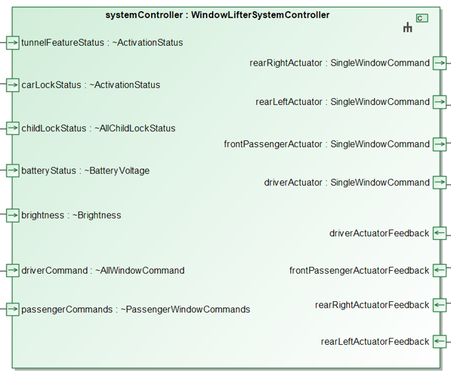
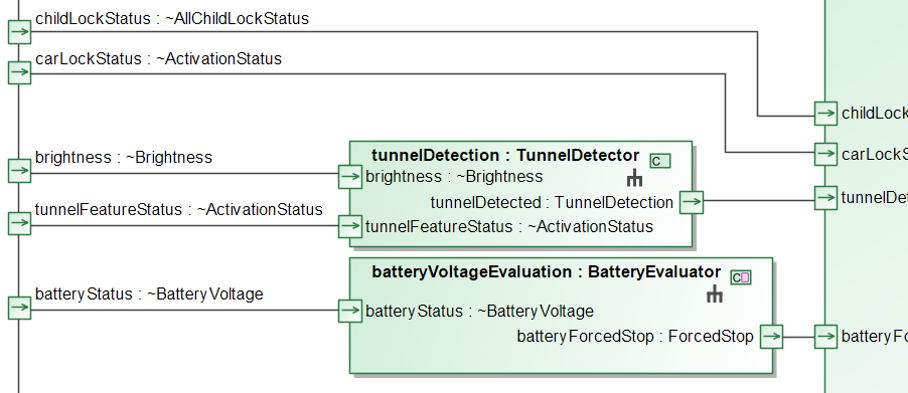
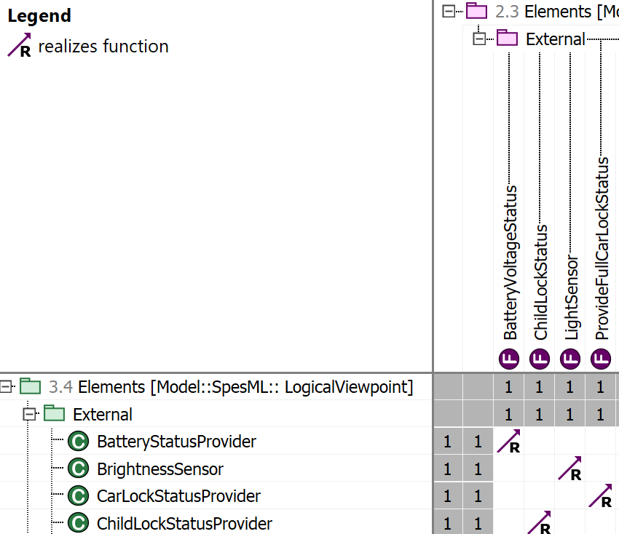
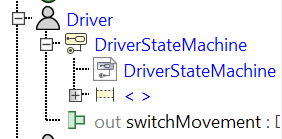

# Logical Viewpoint
<!-- Review: -->
The Logical Viewpoint<!-- Review: If I remember correctly, Wolfgang suggested to always use lower case letter for concept terms such as "logical viewpoint" in the documentation --> is the functional domain of the SpesML MM concerned with the modeling of the logical components. There are three <!-- Review: four? --> focus areas in this Viewpoint: the Logical Component Modeling (LCM), the Logical Architecture Modeling (LAM), the Logical Context Modeling (LTM), and the Logical Physical Modeling (LPM). More information on the Logical Viewpoint can be found [here](https://spesml.github.io/concepts/modeling_framework/logical_viewpoint.html).

## Logical Component Modeling (LCM)
This focus area address the component modeling in the logical viewpoint.

### LCM A: For logical components, their interface is modeled with associated input and output signals. 
This is the most basic capability of this focus area, and functional domain. The other capabilities require this capability to be implemented. *Plugin usage*: <!-- Review: Maybe one or two sentences on what is relevant here would be nice (as e.g. for state machines). Here this could probabaly be mentioning Logical Interfaces with Logical Interface Types and a reference to the screenshot. --> This is described [here](https://spesml.github.io/plugin/logical_viewpoint.html#how-to-model).

{:class="img-responsive"}

### LCM B: The behavior of the logical components is modeled.  
This capability describes that the logical components have their behavior modeled. *Plugin usage*: In the plugin, state machines are used to model the behavior of components. More information on this can be found [here](https://spesml.github.io/plugin/state_machines.html). Another possibility is to use the state machines from the Functional Viewpoint using a Functional-Logical Adpater. More information on this can be found [here](https://spesml.github.io/plugin/logical_viewpoint.html#functional-logical-adapter).

### LCM C: Logical components and requirements they satisfy are related by a satisfy or require relation.
This capability requires that satisfy relation between  components and requirements are explicitly defined in the models. *Plugin usage*: <!-- Review: One sence on whast is relevant would be nice. E.g. "The SpesML pülugin uses a tracing matrix to model this. The Screenshot below shows the possible tracing matrixes in the tool." --> how to do this can be found [here](https://spesml.github.io/plugin/logical_viewpoint.html#spesml-logicaltorequirement-matrix)

{:class="img-responsive"}

## Logical Architecture Modeling (LAM)
This focus area is concerned with the modeling of the relations between components, which form the logical architecture.

### LAM A: The logical components and their dependencies are modeled.
This capability prescribe the connection between modeled components by signal lines. 
{:class="img-responsive"}

### LAM B: Logical components are related to white-box functions that they implement by a realize relation.
The components of the logical viewpoint implement the white-box functions and this is made explicit through a *realize* relation. More on tracing between logical components and functions can be found [here](https://spesml.github.io/concepts/modeling_framework/functional_viewpoint.html#tracing-between-functions-and-elements-of-the-logical-viewpoint).
*Plugin usage*: this information is stored in the SpesML LogicalToFunctional Matrix. More information on this can be found [here](https://spesml.github.io/plugin/logical_viewpoint.html#spesml-logicaltofunctional-matrix).

{:class="img-responsive"}

## Logical conText Modeling (LTM)
In this focus area, the relevant context elements for the logical viewpoint are modeled.

### LTM A: The system under development (i.e., the top-level logical component) is modeled by a composition of all logical components (i.e., internal context).
To have this capability implemented, all components and their dependencies must be modeled, thus allowing the SuD to be modeled as a composition of all components. This is related to the internal context of the SuD. 
Pre-req: LAM A and LCM A.

### LTM B: Actors of the operational context (e.g., external systems or users) are modeled with a syntactic interface (inputs and outputs).  
This capability demands the modeling of the operational (i.e., external) context, which encompasses external systems and users. The image below depicts the logical context of the WindowLifterSytem <!-- Review: "... int which the actors of the operational context are modeled by the grey diagram elements."? -->.
{:class="img-responsive"}

### LTM C: For each actor in the operational context, the behavior is modeled.
This capability describes that the actors have their behavior modeled. *Plugin usage*: In the plugin, state machines are used to model the behavior of actors. More information on this can be found [here](https://spesml.github.io/plugin/state_machines.html). Another possibility is to use the state machines from the respective elements previously defined the Functional Viewpoint using a Functional-Logical Adpater. More information on this can be found [here](https://spesml.github.io/plugin/logical_viewpoint.html#functional-logical-adapter).

{:class="img-responsive"}

The actor also includes external logical components (e.g., BrightnessSensor in the image above)

## Logical Physical Modelling (LPM)  
In the SpesML methodology, physical and mechanical properties of the system and the interaction between physical and cyber components are described in the Logical Viewpoint. This focus area describes the possible levels of maturity a development team can achieve when modelling physical information for a SuD. 

### LPM A: Physical components and cyber components (SW-Subsystem) are identified and modeled as separate components in the logical structure.
Special elements are used to identify and model physical and cyber components in the logical viewpoint.

<!-- Review: Is there an exmaple and/or more details of the implementation in the SpesML tool? -->
  
### LPM B: Interface behavior between the physical components and the SW-Subsystem is modeled on a high level of abstraction.
The interface behavior of the physical and cyber components are modeled on a high level of abstraction.

<!-- Review: Is there an exmaple and/or more details of the implementation in the SpesML tool? -->

### LPM C: Physical behaviour of the SUD and Context elements are modeled on a high level of abstraction.  
This capability requires that the physical behavior of both SuD and Context elements are modeled.

<!-- Review: Is there an exmaple and/or more details of the implementation in the SpesML tool? -->

### LPM D: Aspects of the physical behaviour of the SuD are included when simulating the logical components.
The simulation of the logical components includes the aspects of the physical behavior of the SuD.

<!-- Review: Is there an exmaple and/or more details of the implementation in the SpesML tool? -->