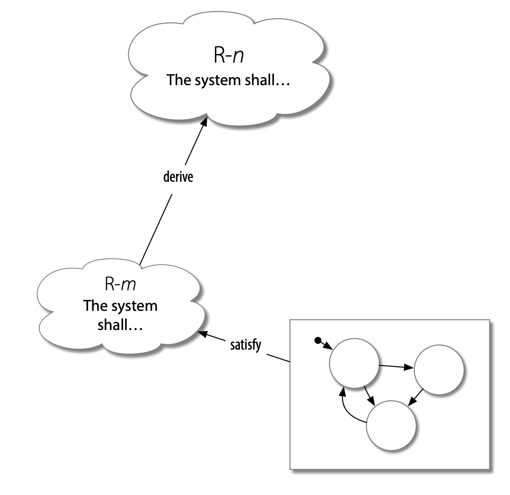

# SpesML Maturity Model

- [Introduction](#introduction)
	- [Focus area maturity models](#focus-area-maturity-models)
	- [MBSE Maturity Model](#mbse-maturity-model)
- [The SpesML Maturity Model](#the-spesml-maturity-model)
	- [The SpesML Maturity Matrix](#the-spesml-maturity-matrix)
	- [Capability description](#the-spesml-maturity-matrix)
		- [Requirements Viewpoint](#requirements-viewpoint)
		- [Functional Viewpoint](#functional-viewpoint)
		- [Logical Viewpoint](#logical-viewpoint)
		- [Technical Viewpoint](#technical-viewpoint)
- [How to use the SpesML MM](#hot-to-use-the-spesml-mm)
- [Relations to the MBSE MM](#relations-to-the-mbse-mm)

# Introduction
On this page, we describe the SpesML Maturity Model (SpesML MM) whose goal is to help teams adopting the SpesML methodology. This is achieved, first, by mapping their current Model-based Systems Engineering (MBSE) processes using the SpesML MM, to figure out which activities are in place and must be *adapted* to the SpesML methodology. And second, by finding out unimplemented capabilities that must be *adopted* anew to reach the desired maturity level for the organization.

The SpesML MM was based on the Model-based Systems Engineering Maturity Model (MBSE MM) developed in the context of the SPEDIT project. The MBSE MM was designed having the SPES methodology as a reference framework. More information on the MBSE MM can be found [here](https://www.fortiss.org/fileadmin/user_upload/05_Veroeffentlichungen/Whitepaper/fortiss_MBSE_whitepaper_web.pdf).

## Focus area maturity models
Maturity models are used to assess the process maturity of a development team, thus guiding further process improvement. Two approaches for implementing maturity models exist. With a top-down approach, a fixed number of maturity stages or levels is specified first and further corroborated with characteristics (typically in the form of specific assessment items) that support the initial assumptions about how maturity evolves. Prominent examples are CMMI or SPICE. 

When using a bottom-up approach, distinct characteristics or assessment items are determined first and clustered in a second step into maturity levels to induce a more general view of the different steps of maturity evolution. They are distinguished from fixed-level maturity models, such as CMMI, in that they are suited to the incremental improvement of functional domains. One class of these bottom-up maturity models is the Focus Area type, where capabilities are defined for different focus areas and arranged in a progressing order that can be mapped to maturity levels. Focus area maturity models are especially effective at providing organizations with implementable practices and processes. The capabilities are grouped in focus area which in turn are grouped in functional domains. In the MBSE MM the latter was renamed to engineering function to emphasize the relation to engineering phases in the development process. The capabilities are positioned against each other in a maturity matrix and assigned letters according to their position (i.e., maturity progression) being the first letters of the alphabet with less maturity than letters that appear closer to the end (i.e., capability B is less mature than a capability D).  

{:class="img-responsive"}

Regarding its possible use, maturity models can be descriptive, prescriptive, or comparative. A maturity model is said to be descriptive when used for assessing the development team's current state. If it suggests improvements, the model is prescriptive, and when it can be used to compare the processes of different organizations, it is also comparative. 

## MBSE Maturity Model

The  Model-based Systems Engineering Maturity Model (MBSE MM) was created during the project [SPES2020](http://spes2020.informatik.tu-muenchen.de/spes%5C_xt-home.html). It is a focus area maturity model which uses the SPES methodology as a reference framework. In the MBSE MM, functional domains are named engineering functions to emphasize the relation to engineering phases in the development process. The MBSE MM has six engineering functions that group a total of fifteen focus areas addressing the different activities that models can support. The focus areas have different capabilities amount, as modeling is not equally distributed over different engineering functions. For instance, Requirements Modeling has many practices while System Testing and Integration has only a tiny amount. The maturity level describes how well MBSE practices are implemented. 

The MBSE MM is fully descriptive, partially prescriptive, and partially comparative. Partially prescriptive because the model diminish the solution space as an assessment tool. But it lacks guidance on selecting the subsequent capabilities to implement. The model is partially comparative because comparisons can be made only at the focus area level. There is no global maturity level requiring certain capabilities and teams might need different kind of needs.

Despite the use of a reference framework, the MBSE MM is not tied to any specific development model (e.g., v-model, waterfall). The maturity levels are described in terms of generic artifacts (i.e., information bites)  generated in the development process (e.g., description of functions' interfaces), and capabilities enhancements (e.g., automatic analysis).

# The SpesML Maturity Model

The SpesML MM is a focus area maturity model. 

The _Functional Domains_ of the SpesML MM were defined based on the four viewpoints supported by the SpesML Modeling Framework, namely Requirements, Functional, Logical, and Technical Viewpoints. 

There are two types of capabilities, namely the normal type and the *Conceptual* type. Capabilities of the later kind are part of the SpesML theoretic framework but the plugin provides no support for it. These are signaled with a '( C)' at the end of its description.

## The SpesML Maturity Matrix

| Viewpoint |                             Focus Areas                             |                                                                                  Capability  A                                                                                 |                                                                                         Capability  B                                                                                         |                                                             Capability  C                                                             |                                               Capability  D                                              |     
|:-----------------------:|:-------------------------------------------------------------------:|:------------------------------------------------------------------------------------------------------------------------------------------------------------------------------:|:---------------------------------------------------------------------------------------------------------------------------------------------------------------------------------------------:|:-------------------------------------------------------------------------------------------------------------------------------------:|:--------------------------------------------------------------------------------------------------------:|
|  Requirements Viewpoint | Requirements   Elicitation (REE)                                    | Requirements   are modeled by a distinct requirement element per requirement.                                                                                                  | Requirements   are categorized into one of the categories: Capability, Functional, Quality,   Constraint. Pre-req: REE A                                                                                      |                                                                                                                                       |                                                                                                          |  
|                         | Requirements Specification (RES)                                    | Requirements   are equipped with attributes containing meta-information including: name,   category, status, rationale, and source.                                             |Requirements   text is formulated following certain sentence templates (e.g., EARS or   Sophist MasterTemplate) ( C).                                                                              | The   requirements text is aligned with modeling elements that they are related to   (e.g., naming of ports or internal states) ( C).      | The   requirement is formalized in a formal specification language (e.g., temporal   logic) ( C).              |   
|                         | Requirements Refinement (REF)                                       | If   a low-level requirement is derived from a high-level requirement, they are   related by a derived relation.   Note: Both requirements   must address the same system scope. | If   a system requirement is broken down to several component requirements, the   system requirement is related to the component requirements by a decompose relation                         | If   a requirement satisfies a property that is required in another requirements,   the requirements are related by a match relation. |                                                                                                          |  
| **Viewpoint** |                             **Focus Areas**                             |                                                                                  **Capability  A**                                                                                 |                                                                                         **Capability  B**                                                                                         |                                                             **Capability  C**                                                             |                                               **Capability  D**                                              |     
|   Functional Viewpoint  | System   Function Modeling (SFM)                                    | System   functions are modeled with a syntactic interface (inputs and outputs).                                                                                                 | System   functions are related with a satisfy or require   relationship to requirements they satisfy or assume.                                                                               | The   behavior of the system functions is modeled by a state machine or decomposed   in a white-box model.                            | The   model of the system functions can be simulated together with a description of   the context.       |   
|                         | White-box Modeling (WBM) | The   white-box functions that implement a system function are modeled with a   syntactic interface (inputs and outputs).                                                       | White-box   functions are related with a satisfy or require   relationship to requirements they satisfy or assume.                                                                            | The   behavior of the white-box functions is modeled.                                                                                 |                                                                                                          |  
|                         | Mode Modeling                                                       | The   operating modes of a system are modeled in terms of a state machine.                                                                                                      | The operating modes in the mode   model are consistent with the mode channels between the systems functions.                                                                                   | It is   automatically analyzed whether transitions between operating states are   correctly maintained by the system functions.       |                                                                                                          |   
|                         | Functional conText Modelling (FTM)                                  | The   system under development (i.e., the top-level system function) is modeled by   a composition of all system functions.                                                    | Functions of   the operational context (e.g., external inputs) are modeled with a syntactic   interface (inputs and outputs). Note: Functions do not need to be allocated to actors yet.       | For   each function in the operational context, the behavior is modeled.                                                              |                                                                                                          |  
| **Viewpoint** |                             **Focus Areas**                             |                                                                                  **Capability  A**                                                                                 |                                                                                         **Capability  B**                                                                                         |                                                             **Capability  C**                                                             |                                               **Capability  D**                                              |     
|    Logical Viewpoint    | Logical Component Modeling (LCM)                                    | For logical   components, their interface is modeled with associated input and output   signals.                                                                               | The   behavior of the logical components is modeled.                                                                                                                                          | Logical   components and requirements they satisfy are related by a satisfy or require   relation.                                    |                                                                                                          |   
|                         | Logical Architecture Modeling (LAM)                                 | The logical   components and their dependencies are modeled.                                                                                                                   | Logical   components are related to white-box functions that they implement by a realize relation.                                                                                             |                                                                                                                                       |                                                                                                          |   
|                         | Logical   conText Modelling (LTM)                                 | The   system under development (i.e., the top-level logical component) is modeled   by a composition of all logical components.                                                | Actors   of the operational context (e.g., external systems or users) are modeled with a syntactic interface (inputs and outputs).                                                          | For each actor in the operational context, the behavior is modeled.                                                                 |                                                                                                          |   
|                         | Logical  Physical Modelling (LPM)                                 | Physical values are modeled.  |   |                         | The behavior of physical components is modeled.                                                                                                         |  
| **Viewpoint** |                             **Focus Areas**                             |                                                                                  **Capability  A**                                                                                 |                                                                                         **Capability  B**                                                                                         |                                                             **Capability  C**                                                             |                                               **Capability  D**                                              |     
|Technical Viewpoint                         | Technical Component Modeling (TCM)                                    | For technical components, their interface is modeled with associated input and output signals.                                                                               | The behavior of the technical components is modeled.                                                                                                                                          | Technical components and requirements they satisfy are related by a satisfy or require  relation.                                    |                                                                                                          |  
|                         | Technical Architecture Modeling (TAM)                                 | The technical components and their dependencies are modeled.                                                                                                                                                                                         | Technical components are related to logical components that they implement by a realize relation.                                                                                             |                                                                                                                                       |                                                                                                          |   
|                         | Technical conText Modelling (TTM)                                 | The system under development (i.e., the top-level technical component) is modeled   by a composition of all technical components.                                                | Actors   of the operational context (e.g., external systems or users) are modeled with a syntactic interface (inputs and outputs).                                                          | For   each actor in the operational context, the behavior is modeled.                                                                 |                                                                                                          |  

## Capability description

In the following, we describe each capability in detail, grouped by respective Viewpoint and Focus area.

### Requirements Viewpoint
There are three focus areas in this Viewpoint: the Requirements Elicitation (REE), the Requirements Specification (RES), and the Requirements Refinement (RER). More information on the Requirements Viewpoint can be found [here](https://spesml.github.io/concepts/modeling_framework/requirements_viewpoint.html).  

####  Requirements Elicitation (REE): 
This focus area is the smallest of this Viewpoint, having only two capabilities. 

**REE A: Requirements are modeled by a distinct Requirement Element per requirement.** -- This capability describes that requirements are modeled in the SpesML plugin using the Requirement 
Element. 
*Using the plugin*: The engineer should right click the containment tree in the RequirementsViewpoint folder, and select create element->create a SpesML Requirement element as depicted in the image below.
{:class="img-responsive"}
The REE A is a very basic capability. Despite having the lowest maturity in this Viewpoint, all the other capabilities from this Viewpoint requires it.  

**REE B: Requirements are categorized into one of the categories: Capability, Functional, Quality, Constraint.** 
This capability can be considered implemented when the Requirement Element category is defined. The categories supported by the SpesML Modeling Framework are described [here](https://spesml.github.io/concepts/modeling_framework/requirements_viewpoint.html#modeling-elements).
#### Requirements Specification (RES)

This focus area has four capabilities. Three of them are of the Conceptual type. 

**RES A: Requirements are equipped with attributes containing meta-information including: name, category, status, rationale, and source.**: The SpesML Modeling framework supports a number of attributes and serving as template, which segregate information from the requirement description, improving readability.  
*Using the plugin*: The attributes of a requirements can be accessed through right click menu->properties. The image below depicts how they are presented in the plugin.
{:class="img-responsive"}
Additional information on requirement attributes can be found [here](https://spesml.github.io/concepts/modeling_framework/requirements_viewpoint.html#requirements-attributes).

**RES B: Requirements text is formulated following certain sentence templates (e.g., EARS or Sophist MasterTemplate) ( C).**
Sentence template require extra effort to achieve compliance at the initial phases, but prevents rework in future phases. Although the SpesML MF do not suggest using a specific template, it does suggest they should be used, whichever better fits the organization's needs (e.g, domain, project size). This is a *Conceptual* capability
**RES C: The requirements text is aligned with modeling elements that they are related to (e.g., naming of ports or internal states) ( C).** This capability is related to the documentation of architecture elements within a requirement description (e.g., the naming of ports). This capability requires (?) the LCM C. This is a *Conceptual* capability.
**RES D: The requirement is formalized in a formal specification language (e.g., temporal logic) ( C).** This capability characterizes requirements described using formal representations, for instance in the property specification language which is being looked into in a separate project activity, or as formulas in a temporal logic. Formal representations typically are required to be reviewed in order to ensure that architectural model and property specification are consistent. This is a *Conceptual* capability.

Some capabilites were not implemented in the plugin, hence they are called *Conceptual* and they have a ( C) in their description. Capabilities RES B, C, and D are Conceptual, hence the plugin does not provide support (e.g, automated consistency and correctness). More information on these properties can be seen [here](https://spesml.github.io/concepts/modeling_framework/requirements_viewpoint.html#requirements-representation).

#### Requirements Refinement (REF)
The capabilities in this focus area represent types of tracing relations that exist between requirements, and between requirements and architectural elements. More on requirements tracing relations can be seen in this [link](https://spesml.github.io/concepts/modeling_framework/requirements_viewpoint.html#tracing-relationships).

**REF A: If a low-level requirement is derived from a high-level requirement, they are related by a derived relation. Note: Both requirements must address the same system scope.**
The _Derive_ relationship is used to add detail or to include certain design decisions to a requirement. Unlike RES C, where the design decisions are included in the requirement description, REF A is about two different requirements related by this specific tracing relation. It is a common pattern that an architectural element satisfies a requirements, which itself is derived from a more high-level requirement as depicted in the figure below:
{:class="img-responsive"}

**REF B: If a system requirement is broken down into several component requirements, the system requirement is related to the component requirements by a decompose relation.**
The decompose relation traces related requirements. Unlike REF A, these requirements do not necessarily belong to the the same systems scope. 
The image below depicts the properties of this relation.
{:class="img-responsive"}

**REF C: If a requirement satisfies a property that is required in another requirement, the requirements are related by a Match relation.**
The *Match* relation traces an architectural element to a requirement of type *Requirement*.  One instance of Match relation is the one used in requirement definiing safety contracts for dynamic systems of systems. In this kind of systems, some specific levels of safety assurance are required to guarantee safety of the whole system.

 
### Functional Viewpoint

More on the Functional Viewpoint can be seen [here](https://spesml.github.io/concepts/modeling_framework/functional_viewpoint.html).

#### System Function Modeling (SFM)

**SFM A: System functions are modeled with a syntactic interface (inputs and outputs)**.
The image below depicts the CentralWindowFunction and its respective input and output interfaces.
{:class="img-responsive"}

**SFM B: System functions are related with a satisfy or require relationship to requirements they satisfy or assume.**
The satisfy relation traces the requirement to a function, which is useful to identify whether there are requirements not addressed by any function, or if there are functions that do not fulfill any requirement. In the SpesML plugin, this relation is described with a table as depicted in the figure below.

{:class="img-responsive"}

**SFM C: The behavior of the system functions is modeled by a state machine or decomposed in a white-box model.**  
This capability is related to 
**SFM D: The model of the system functions can be simulated together with a description of the context.**  

#### White-box Modeling (WBM)
The capabilities of this focus area are related to the modeling of the white-box functions.

**WBM A: The white-box functions that implement a system function are modeled with a syntactic interface (inputs and outputs).**  
*Using the plugin*: After the white box is created and placed 

{:class="img-responsive"}

**WBM  B: White-box functions are related with a satisfy or require relationship to requirements they satisfy or assume.**
The image of SMF B also depicts this capability.

**WBM  C: The behavior of the white-box functions is modeled.**  
{:class="img-responsive"}

#### Mode Modeling (MOM)
This focus area describes the implementation of modes of the SUD as described [here](https://spesml.github.io/concepts/modeling_framework/functional_viewpoint.html#mode-model).

**MOM A: The operating modes of a system are modeled in terms of a state machine.**

The SUD context, inside (FTM A), outside (FTM B), and its behavior (FTM C) are contemplated by this focus area. 

**FTM A: The system under development (i.e., the top-level system function) is modeled by a composition of all system functions.**
The GIF below shows inside the system functions inside the SUD in the plugin. FIXME
{:class="img-responsive"}

**FTM B: Functions of the operational context (e.g., external inputs) are modeled with a syntactic interface (inputs and outputs). Note: Functions do not need to be allocated to actors yet**  

**FTM C: For each function in the operational context, the behavior is modeled.**
Sister capabilities are LTM C and TTM C.
### Logical Viewpoint

More on the Logical Viewpoint can be seen [here](https://spesml.github.io/concepts/modeling_framework/logical_viewpoint.html).

#### Logical Component Modeling (LCM)

**LCM A: For logical components, their interface is modeled with associated input and output signals.**  

{:class="img-responsive"}

**LCM B: The behavior of the logical components is modeled.**  

**LCM C: Logical components and requirements they satisfy are related by a satisfy or require relation.**

{:class="img-responsive"}

#### Logical Architecture Modeling (LAM)

**LAM A: The logical components and their dependencies are modeled.**  
{:class="img-responsive"}

**LAM B: Logical components are related to white-box functions that they implement by a realize relation.**
{:class="img-responsive"}

More on tracing between logical components and functions can be found [here](https://spesml.github.io/concepts/modeling_framework/functional_viewpoint.html#tracing-between-functions-and-elements-of-the-logical-viewpoint).

#### Logical conText Modelling (LTM)

**LTM A: The system under development (i.e., the top-level logical component) is modeled by a composition of all logical components.**

**LTM B: Actors of the operational context (e.g., external systems or users) are modeled with a syntactic interface (inputs and outputs).**  
The image below depicts the WindoLifterSytem in the Logical Context view.
{:class="img-responsive"}

**LTM C: For each actor in the operational context, the behavior is modeled.**

{:class="img-responsive"}

The actor also includes external logical components (e.g., BrightnessSensor in the image above)

#### Logical Physical Modeling (LPM)
tbd...
**LPM A: Physical Quantities are assigned to external logical components. (tentative**

**LPM B:...**

### Technical Viewpoint
#### Technical Component Modeling (TCM)                                    
**TCM A: For technical components, their interface is modeled with associated input and output  signals.**
**TCM B: The behavior of the technical components is modeled.**                                                                                                                                       
**TCM C: technical components and requirements they satisfy are related by a satisfy or require  relation.**                                                                                                                           
#### Technical Architecture Modeling (TAM)                                 
**The technical components and their dependencies are modeled.**          
                                                                                                         **Technical components are related to logical components that they implement by a realize relation.**           
#### Technical conText Modelling (TTM)                                
**TTM A: The   system under developm	ent (i.e., the top-level technical component) is modeled by a composition of all technical components.**

**TTM B: Actors  of the operational context (e.g., external systems or users) are modeled with   a syntactic interface (inputs and outputs).** 

**TTM C: For  each actor in the operational context, the behavior is modeled.**

# How to use the SpesML MM
The usage of the SpesML MM is similar to the MBSE MM.

{:class="img-responsive"}

**T1: Assess current processes**
Equipped with the SpesML MM, the organization should compare their current MBSE development processes with the capabilities described in the maturity matrix. For each capability in the matrix, engineers should question whether they produce similar artifacts. For instance, the capability RES A mandates some attributes to be identified and could be the case that the organization does identify some attributes but not all of the ones described in this capability. This capability then is marked as TO BE ADAPTED. If the organization does not do anything similar to what is described in the capability then it should be marked as UNIMPLEMENTED.

**A1: Current processes similar to SpesML MM capabilites**
This artifact is a list of capabilities from the SpesML MM that are similar to the current development activities the organization already employs. With this information, the organization can know which activities need to be fitted to the SpesML MF and which capabilities need to be adopted anew. 

**T2: Identify implementation goal**
At this task, the organization should think about their modeling needs, which should to take into consideration how their development unit is located within the whole development life cycle. This is the case if a full implementation of the SpesML Modeling Framework is intended or not. 

**A2: Implementation goal**
This artifact is produced in task T2 and lists all capabilities that the organization should have in place in order to achieve its implementation goal.

**T3: Adapt current processes**
The current processes that were identified as similar to the SpesML capabilities must be adapted to how is prescribed by the modeling framework. These processes are identified in task T1 and are described in artifact A1.

**T4: Adopt missing capabilities**
In this task, capabilities that were not identified as similar in task T1 must be adopted taking into consideration the implementation goal as described by artifact A2.

## Relations to the MBSE MM

