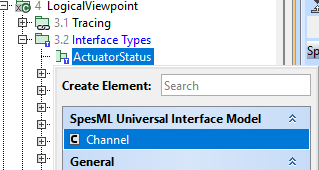
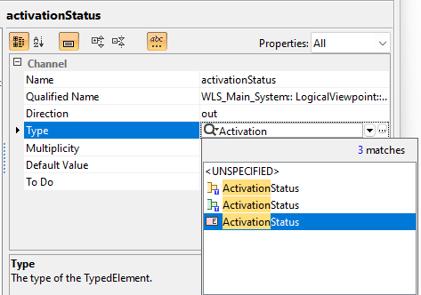
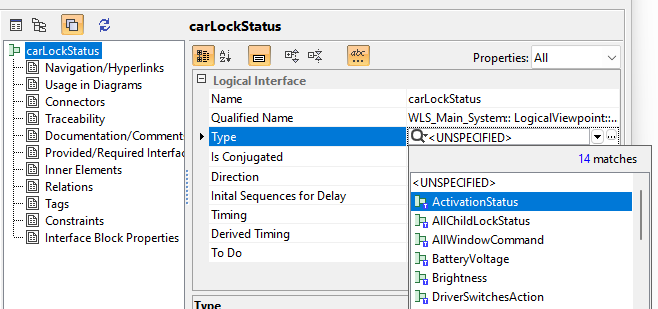
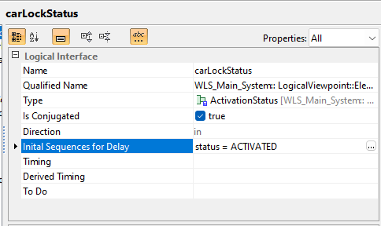
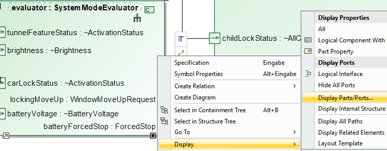
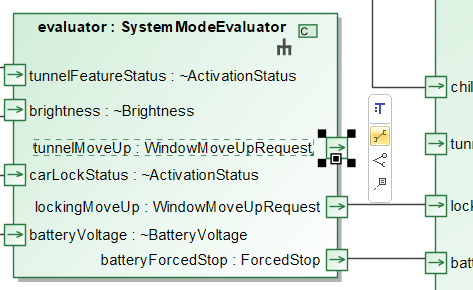
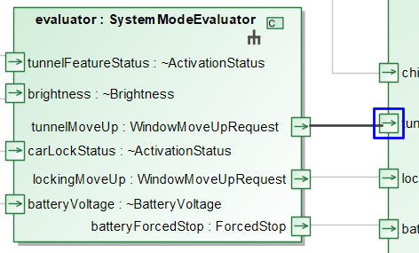

# Modeling Interfaces

## Overview
In all viewpoints (i.e. Functional VP, Logical VP, Technical VP) the available models allow to describe the interface of the respective system elements (i.e. functions, logical components, technical components).  In the SpesML plugin, modeling the interfaces in all views follows the same method using the same concepts. The only difference is that the model elements have different names (e.g. "Functional Interface" vs. "Logical Interface").

## Method
### General
<div align="center">

<br><b>Figure 1:</b> 
Model elements for interface, in brackets the names in the logical viewpoint as examples.
</div><br>

Figure 1 shows the modeling elements for the interfaces. 

* **Interface:** A system element (such as a logical component from the logical view, a (black-box/white-box) function from the functional view or a technical component from the technical view) owns one or more interfaces. In the different views, the interfaces are named "Logical Interface", "Functional Interface", "Technical Interface" etc. An interface can be either a source interface (messages are flowing out of the owning system element) or a target interface (messages are flowing into the owning system element). To mark an interface as a target interface, the interface must be *conjugated*. 
* **Interface Type:** An interface is always typed. That means, it is associated with an interface type. Again, in the different views an interface type is termed "Logical Interface Type", "Functional Interface Type", "Technical Interface Type" etc. An interface type must always be named and may only contain channels as sub-elements.
* **Channel:** The interface type describes what can flow out of a system element by the means of channels. Therefore, each interface type owns one or more channels. Channels always are named and represent unidirectional communication from the source interface to the target interface. Although a channel has a direction, this direction must always be set to "out". This restriction makes it possible to clearly see which information is flowing in which direction. In order for a channel to represent an input, the property "Is Conjugated" needs to be set at the interface.
* **Data Type:** Each channel again is typed with a data type, describing what kind of messages are exchanged via this channel. Details on data types can be found [here](https://spesml.github.io/plugin/data_types.html). Note, that data types must not be confused with interface types. While interface types only type interfaces, data types only type channel (which in turned are owned by interface types).
* **Connector:** Two interfaces may be connected using a connector, which describes that messages can flow between the interfaces.

To specify that two system elements interact, their interfaces may be connected by *connectors*.

### Strong Causality
Strong causality modulo some output channels can be introduced by delaying the outputs of an interface. An interface can be delayed by
adding a value to the ```Initial Sequences for Delay``` property.  The ```Initial Sequences for
Delay``` property can only be given a value for interfaces where the conjugated
property is set to _false_, i.e., only output channels can be delayed. If the
property is given a value in an interface, then all channels represented by the port
are delayed. 

The sequences of messages initially communicated via the delayed channels is
defined by the value of the property ```Initial Sequences for Delay```. Values
of the property ```Initial Sequences for Delay``` are finite sequences of the
form _channel_ ```= ```_Expr_```;``` where _channel_ is the name of a channel and _Expr_ is an expression
evaluating to a value of the channel's type. The expression cannot
reference any variables. Every channel may be used on the left-hand side
at most once. If a channel is not used on the left-hand side at all, then
the empty sequence is initially communicated via the corresponding channel.  

### Composition
System elements are composed by connecting their interfaces with **connectors**. 
Two interfaces may only be connected via a connector if they have the same types and their directions match.
The directions of two interfaces match if one of the following conditions is satisfied:
1. Both interfaces are either conjugated or not conjugated but one interface is owned by the system element above in the composition hierarchy. This represents the situation where messages are routed inside into to outside from a system element. 
2. One of the interfaces is conjugated and the other interface is not conjugated and both owning system elements are on the same level in the composition hierarchy.

## How to Model

### How to Create an Interface
1. Select a system element for which you want to create an interface in the containment tree  (e.g. a logical component). 
Model elements for interface, in brackets the names in the logical viewpoint as examples.

2. Right-click the system element and select "Create Element".
 
   
   
3. From the popup, choose the appropriate interface (e.g. "Logical Interface" for a logical component)

   
   
4. Name the interface  

   

5. If the newly created interface represents an input interface, set the interface as conjugated. This can be done by opening the specification window for the newly created interface (Right-Click -> Specification) and setting the property "Is Conjugated" to true.

   

### How to Type an Interface
1. If a suitable interface type already exists, jump to step 9. If not create a new interface type as follows.
2. Choose a suitable package for your interface type (e.g. a package named "Interface Types").
3. Right-click on the package and select "Create Element".
4. In the popup choose the appropriate Interface Type (e.g. "Logical Interface Type" for a logical interface).

   

5. Name the newly created interface type.
6. The newly created interface type has no channels yet. To create a channel right-click the interface type and select "Create Element". In the popup, select "Channel".

   
   
7. Name the channel and assign the channel a type by pulling a data type on the channel in the containment tree or selecting the type in the specification window of the channel.

     
     
8. To assign an interface type to an interface, either pull to interface type onto the interface in the containment tree. Alternatively, you can open the specification window of the interface and set the interface type in the "Type" property.

     

### How to mark an interface as delayed
1. Open the specification window for the interface. Mind that only output interfaces (i.e. interfaces that are not conjugated) can be delayed.
2. Set the property "Initital Sequence for Delay" to an expression in the form __channel1=value1,value2,value3;...;channelX=value1,value2,value4__. This would set the initial sequence for channel named "channel1" to the sequence "value1, value2, value3". The channels in the expressions must be present in the interface type of the interface.

   

### How to connect interfaces
1. Open a diagram showing the internal structure of a system element (e.g. a Logical Internal Component Diagaram, but also context diagrams are possible).
2. Locate the system elements on the diagram that you want to connect via interfaces.
3. Make sure the interfaces you want to connect are visible. You can choose the visible interfaces by right-click on an element in the diagram and selecting "Display" -> "Display Parts/Ports"

   
   
4. Make sure the interfaces have the same interface type and the directions of the interfaces match (see section "Composition" above)
 
5. In the smart manipulator of the source interface, choose the connector icon ...

   
    
6. ... and pull the connector to the target interface.

  
    
## Well-formedness Rules

### General Rules 
* Interfaces, Interface types, and channels must be named

### Interfaces
* System elements need to specify at least one interface
* Interfaces are required to have an interface type
* Channels have the direction "out"
* Channels need to have a data type, see [Data Types Documentation](https://spesml.github.io/plugin/data_types.html)

### Composition
* Connectors must only connect interfaces with same type.
* Connectors must always connect interfaces with matching directions (see above).
